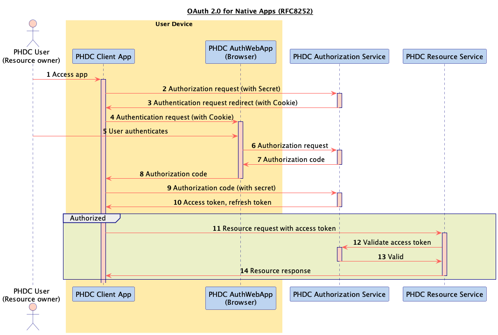
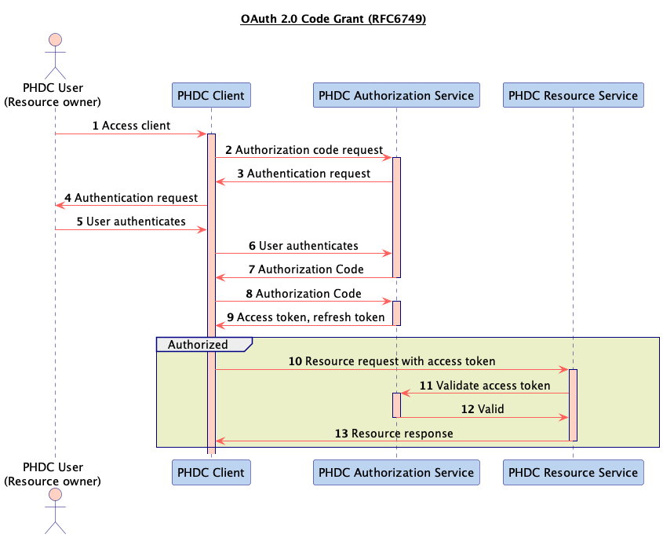

# Authorization Documentation

This section covers the authorization project features of the SDK. Authentication is the process of verifying who a user is, while authorization is the process of verifying what they have access to.

## Starting authorization requests

The authorization request is started with the following code sample which launches an [Custom Tab](https://developer.chrome.com/docs/android/custom-tabs/)
to present the login screen to the user for authentication.

```
Intent authIntent = Data4LifeClient.getInstance().getLoginIntent(null);
startActivityForResult(authIntent,requestCode);
```

You can pass along optional `scopes`, otherwise the SDK uses the default scopes for the authorization request.

## Ending authorization requests

Once the user finished, canceled or an error occurred during the browser login, the SDK sends the response to the
integrator application in the `onActivityResult(…)` method.

The authorization results can be the following:

- `Activity.RESULT_OK` – when the login is successful.
- `Activity.RESULT_CANCELED` – when the login fails, with additional payload in `data`, as shown in the example.

To end the login you need to call `finishLogin(authData, callback)` with the intent received in `onActivityResult(…)`.
The callback will indicate if the authorization successfully finished.

```
@Override protected void onActivityResult(int requestCode, int resultCode, Intent data) {
    super.onActivityResult(requestCode, resultCode, data);
    if (requestCode == GC_AUTH) {
        if (resultCode == RESULT_OK) {
            client.finishLogin(data,callback);
        } else if (data.getExtras() != null) {
            if (data.getExtras().containsKey("error")) {
                Snackbar.make(mRootCL, "Failed to log in to Data4Life", Snackbar.LENGTH_SHORT).show();
            } else if (data.getExtras().containsKey("canceled")) {
                Snackbar.make(mRootCL, "User canceled authorization request", Snackbar.LENGTH_SHORT).show();
            }
        }
    }
}
```

## Authorization diagrams




